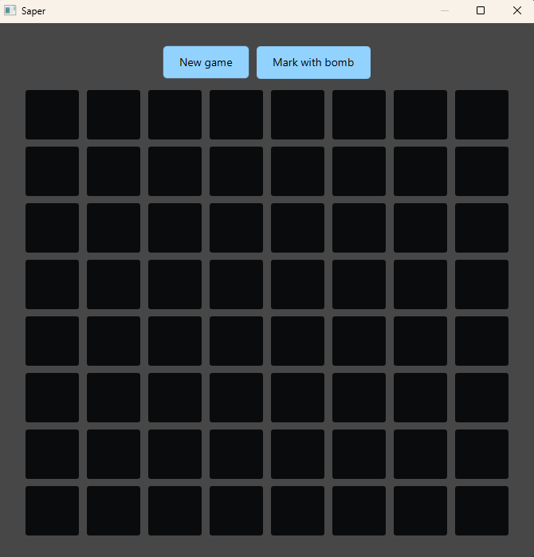
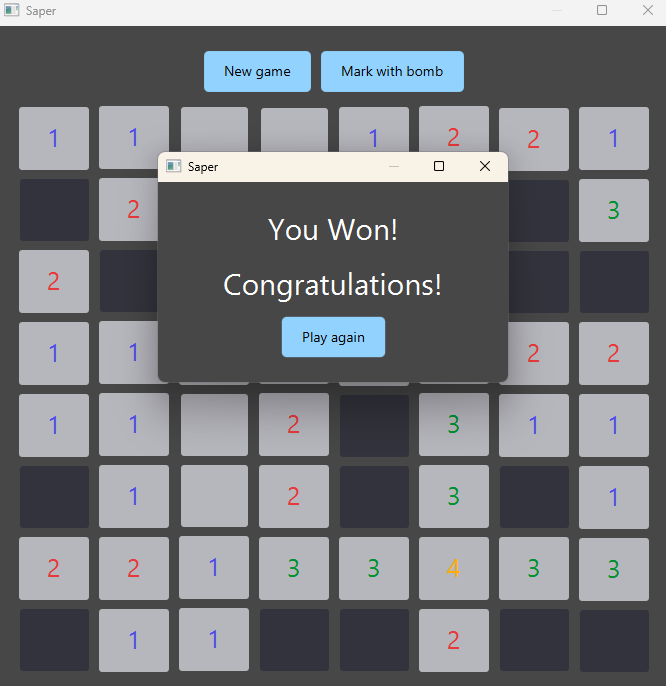
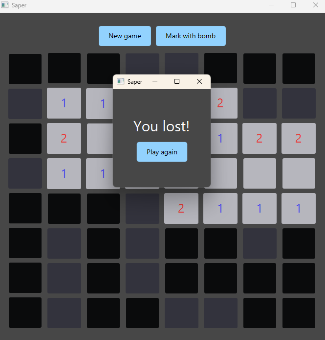

# Minesweeper

**Minesweeper** is a classic logic puzzle game. <br>
The goal is to clear the board without detonating any mines, while marking the cells where you think mines are located.

## Starting screen:


## Game screen:


## Winning screen:


## Losing screen:



## How to run

1. Download the ZIP or clone the repository:
   ```bash
   git clone https://github.com/wwercia/MinesweeperGame.git
2. Open a terminal/command prompt and navigate to the folder containing the pom.xml file.

3. Run the application by typing in cmd:

    ```bash
    mvn javafx:run

## Features

- Mark cells where you think there are mines using the "Mark with bomb" option
- Start a new game at any time with the "New Game" option
- The layout of mines and the entire board is randomized, making every game unique